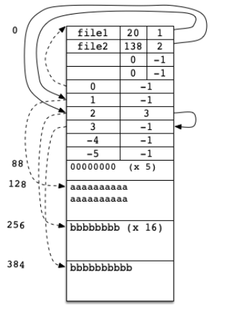

# Simulated File System (simfs) - README

## Project Overview

This project implements a simulated file system, referred to as `simfs`, which is stored within a single Unix file. The system simulates a basic file storage and management mechanism with restrictions on the number of files (`MAXFILES`) and the amount of disk space (`MAXBLOCKS`). The goal of the project is to add core functionality to this simulated environment, allowing users to interact with the file system by creating, deleting, writing, and reading files.

Through this project, you will:
- Gain insight into how file systems are implemented.
- Learn how to handle both binary and ASCII file I/O.
- Develop skills in using arrays of structs and character manipulation.

## Features

1. **Create a File**  
   Ability to create a new file in the simulated file system. File creation will return an error if the maximum file count (`MAXFILES`) is reached or if the file name already exists.

2. **Delete a File**  
   Functionality to delete an existing file from the file system. This will free up the space occupied by the file and update the internal system structures accordingly.

3. **Write to a File**  
   Allows the user to write data into an existing file. File size is restricted by the available free blocks (`MAXBLOCKS`). If the written data exceeds the available space, an error will be returned.

4. **Read from a File**  
   Users can read the contents of an existing file, provided the file exists in the system.

## Project Structure

The simulated file system (`simfs`) is managed using arrays of structs and character data types to mimic real-world file system behavior. Key structures include:
- **File Descriptor Table**: Holds metadata about each file (name, size, starting block).
- **Data Blocks**: A set of fixed-size blocks that store the actual file data.
- **Free Space Management**: Keeps track of available space in the file system.

## Key Constraints

- **MAXFILES**: The maximum number of files the system can hold.
- **MAXBLOCKS**: The maximum amount of disk space available for storing files.

## File System

## Learning Outcomes

- Implementing file system persistence across program executions.
- Enhancing file system structure with directories and subdirectories.
- Adding user-level permissions for files.